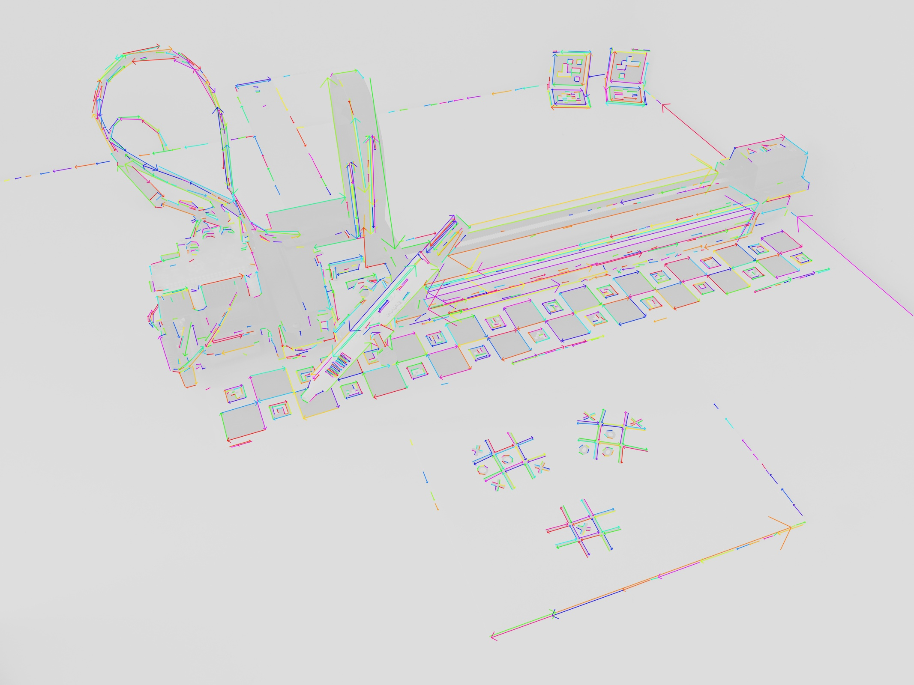

# tictactoebot

A robot that plays tic-tac-toe.

## Overview

The goal of this project is to have a robot that can play tic-tac-toe games physically, on a piece of paper, as naturally as possible.
This implies the robot being able to recognize hand-draw games and add drawings to them itself.  
In order to simplify the user interface to the minimum (in this case pen and paper only), the robot never plays first, it waits until it can see a grid where a player is behind on moves and plays that.
That also allows to keep the AI and processing stateless and play multiple games simultaneously.

## Implementation

Images are captures and transmitted as an `mjpeg` stream from an Android phone running [IP Webcam](https://play.google.com/store/apps/details?id=com.pas.webcam) to a laptop for processing.  
OpenCV is then used to detect game grids and identify the symbols they contain.  
For each identified grid containing a different number of `X`s and `O`s we run a minimax algorithm to determine the best play for the appropriate player and generate the corresponding drawings on the image. If any play drawings are generated, they are projected to the robot's physical drawing space using an [arUco board](https://docs.opencv.org/3.4.0/db/da9/tutorial_aruco_board_detection.html) as a reference.  
The robot component of this project is an [AxiDraw v3 from Evil Mad Scientist](https://shop.evilmadscientist.com/productsmenu/846) coupled with a [Raspberry Pi Zero](https://www.raspberrypi.org/products/raspberry-pi-zero/) allowing it to be controlled over HTTP.

### OpenCV process

The following process is used to detect hand-drawn games,
starting with the output of the built-in [Line segment detector](https://docs.opencv.org/3.0-beta/modules/line_descriptor/doc/LSDDetector.html):

close parallel segments are merged together:

Intersecting segments are grouped:

Groups containing 2 intersecting sets of parallel lines are further checked to identify grids, then the contents of each cell are processed to identify symbols based on contour properties (length, area, convex hull, holes):

## Improvements

The system in its current state is working and can play games against a human player, however, improvements could be made to different subsystems:

- Grid detection refinements: the post-processing step applied to the LSD output produces straight lines that can't exactly match imperfect hand-drawn grids. This could be improved by refining the position of each node in the detected grids with regard to the original input image.
- Symbols detection: the current method involves hard-coded guesstimated ratios, deriving those from a reference training set of known symbols would probably be better.
Once a training set is available looking into other OCR-type methods would probably be beneficial too.
- Tracking: matching detected grids between frames would allow to improve the main process by reducing the computation load (no need to run AI if game hasn't changed) and making the detection more stable (noise in the capture can affect symbol identification , aggregating results for the same grid over multiple frames would help mitigate this)
- alpha-beta pruning on the minimax search
